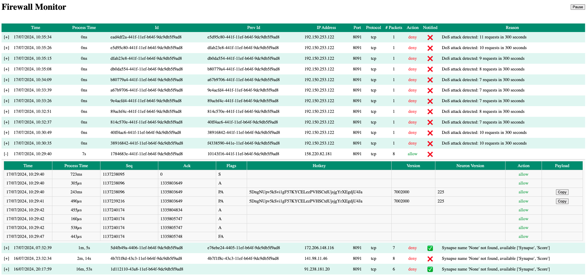

[Back to Firewall README](../../docs/features/firewall.md)

The UI allows you to see the packets received by your machine in real time and shows whether each request has been allowed or dropped.

> IMPORTANT <br />
> The UI can be installed on the miner machine or any other machine. To avoid impacting the performance of your miner, it is highly recommended to install it on a separate machine.

<br />

---

- [Installation](#installation)
- [Uninstallation](#uninstallation)
- [How does it work?](#how-does-it-work)
  - [Data source](#data-source)
  - [Packet content](#packet-content)
  - [Filtering](#filtering)
- [Contribution](#contribution)

<br />

# Installation

> IMPORTANT <br />
It is highly recommended to install the UI on a different machine than the miner to avoid negatively impacting your miner's performance.

To install the UI, run

```bash
pm2 start ui/firewall/firewall-monitor.py --name firewall --interpreter python3 -- --event-source-url http://<MINER_IP>:<MINER_SSE_PORT>
```

Options

- `MINER_IP`: The IP address of the miner where the SSE server is hosted.
- `MINER_SSE_PORT`: The SSE port configured on the miner using the `--sse.port` option.

To check the UI Backend, display log by running

```bash
pm2 log firewall
```

You should see

```bash
* Running on all addresses (0.0.0.0)
 * Running on http://127.0.0.1:8080
 * Running on http://x.x.x.x:8080
Press CTRL+C to quit
```

To check the UI Frontend, open the browser and go to `http://<SERVER_IP>:8080`

<br />

# Uninstallation

To uninstall the UI, stop and delete the process

```bash
pm2 stop firewall
pm2 delete firewall
```

<br />

# How does it work?



## Data source

The UI get the requests from a backend that read this information from a njson file `firewall-events.json` used by the firewall itself. The refresh happens every seconds.

> IMPORTANT <br />
> Do not update manually the njson file and keep an eye on the size by running `ls -lh SubVortex` as you do not want that file to reach a size that will impact the performance of your machine

## Packet content

When a request has a PA packet associated, the user will be able to see the content.

Because, the UI refresh everything second, you have to pause it by clicking on the button `Pause` and then click on the button `Copy` of the PA packet you want. Otherwise, it will be harder to effectively copy it.

Then, you can use `https://www.base64decode.org/` to decode the encoded content.

> IMPORTANT <br />
> Decoding the content may not work all the time because of potential attacks, wrong synapse, etc.

## Filtering

By default, the UI will display all the requests that went through the firewall. Some filtering are available to narrow the focus

- Filter by source ip: `http://<SERVER_IP>:8080?sip=x.x.x.x`
- Filter by ddestination port: `http://<SERVER_IP>:8080?dport=8091`
- Filter by action: `http://<SERVER_IP>:8080?status=allow`

<br />

# Contribution

The firewall UI was developed quickly and was not part of our initial roadmap, but we wanted to provide users a way to check their behavior.

We invite anyone in the community to help improve and professionalize the UI. Join the SubVortex project to enhance your skills and earn credit for your contributions.
